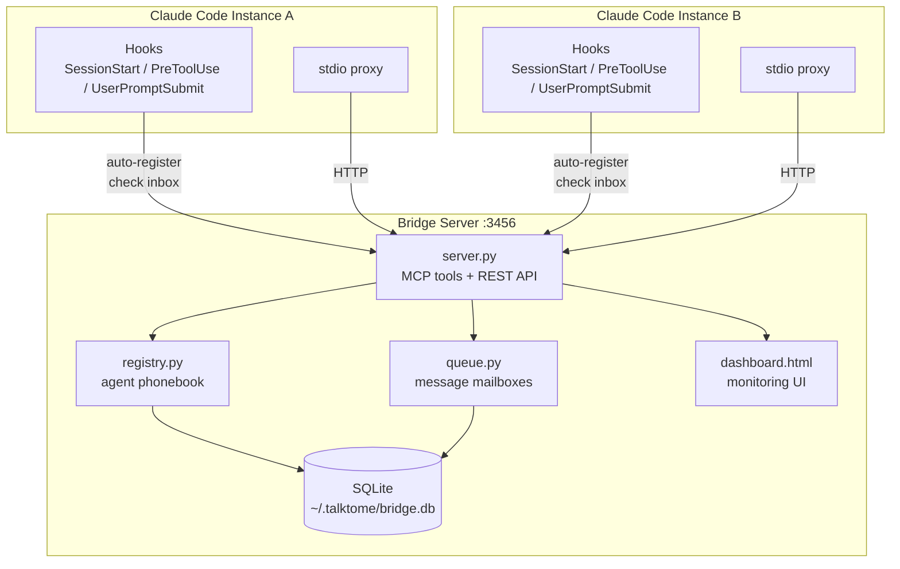
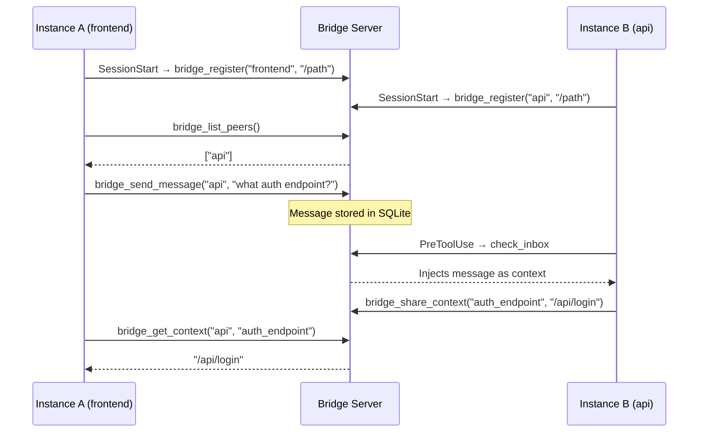
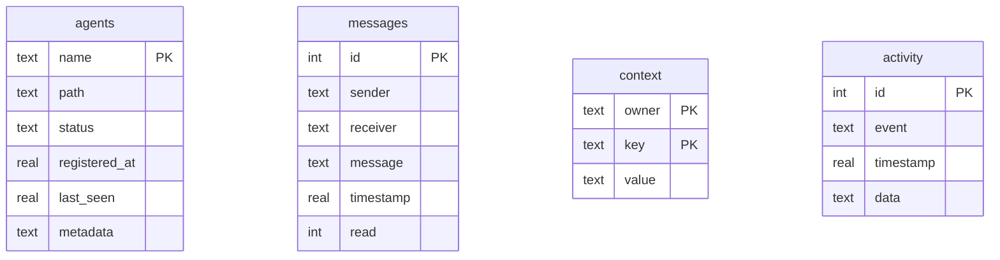

# Architecture

## Overview

A bridge server that lets multiple Claude Code instances discover each other, exchange messages, and share context. Runs as an MCP server over HTTP with SQLite persistence.

## System diagram

## Data flow

## Files

| File | Purpose |
|---|---|
| `src/talktome/server.py` | MCP tools + REST endpoints + dashboard |
| `src/talktome/db.py` | SQLite persistence layer (WAL mode) |
| `src/talktome/registry.py` | Agent registration, thin wrapper over db |
| `src/talktome/queue.py` | Message mailboxes, thin wrapper over db |
| `src/talktome/proxy.py` | Stdio-to-HTTP proxy, auto-starts bridge |
| `src/talktome/dashboard.html` | Live monitoring UI |
| `hooks/hooks.json` | Hook definitions for all lifecycle events |
| `hooks/auto_register.py` | SessionStart hook, registers agent with bridge |
| `hooks/check_inbox.py` | PreToolUse/UserPromptSubmit hook, polls mailbox |
| `skills/bridge/SKILL.md` | Slash command instructions for Claude |

## Database schema

