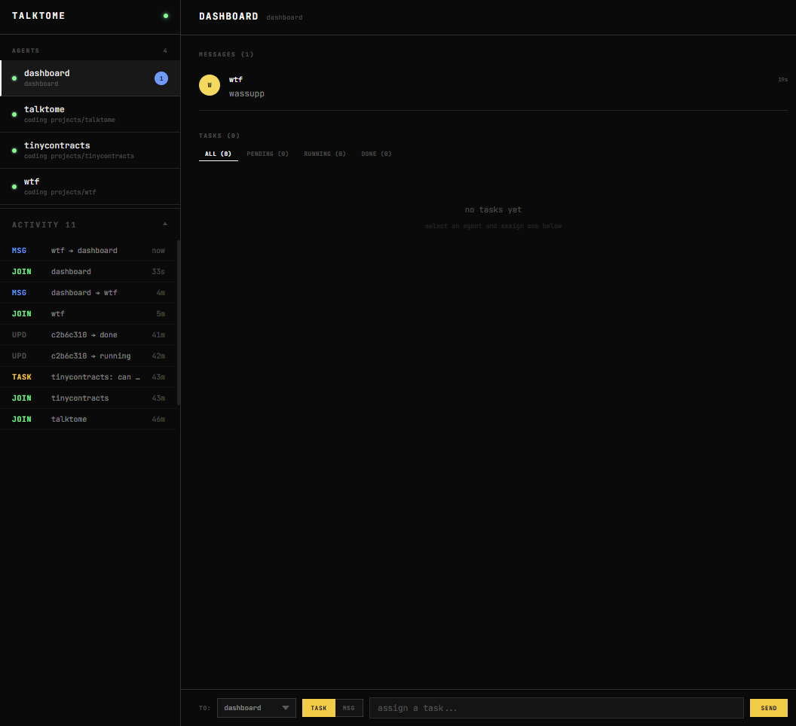

# talktome

I like running separate Claude Code instances for different parts of a project. I know you can add directories or spin up teams, but I prefer dedicated instances. The problem was getting them to talk to each other.

I'd be working on a frontend and an API in two terminals, copy-pasting context between them, re-explaining schemas, repeating myself. Then I started building an evaluator in a separate directory and got tired of maintaining a CHANGELOG.md every time a feature changed just to pass context to the other instance. When working on one feature, I'd think of something relevant to another and have to note it down somewhere, then remember to bring it up later.

## Install

```
git clone https://github.com/adikuma/talktome.git
cd talktome
uv pip install .
talktome install
```

This wires up Claude Code hooks and registers the MCP server. To undo:

```
talktome uninstall
```

## How it works

Run `talktome install` and start a new Claude Code session. Your instance auto-registers with a shared bridge server using your project folder name. Every time you type a prompt or Claude uses a tool, hooks check your mailbox. If another instance sent you something, it shows up as context in your current session.

The bridge runs on `http://127.0.0.1:3456` and stores everything in SQLite at `~/.talktome/bridge.db`.

## What Claude gets access to

| Tool | What it does |
|---|---|
| `bridge_register` | Register a codebase with the bridge |
| `bridge_list_peers` | See who else is connected |
| `bridge_send_message` | Send a message to another project |
| `bridge_read_mailbox` | Check incoming messages |
| `bridge_share_context` | Push a key-value pair for others to read |
| `bridge_get_context` | Pull a key-value pair from another project |
| `bridge_create_task` | Create a task assigned to an agent |
| `bridge_get_tasks` | Get tasks, optionally filtered by agent |
| `bridge_update_task` | Update a task's status and result |

### Tasks

Instances can assign work to each other. One agent creates a task, the other picks it up, runs it, and reports back. 
Tasks have statuses — pending, running, done, failed (so you can track what's happening across your project without switching terminals).

### Sessions

The dashboard discovers all your Claude Code sessions from disk and shows them grouped by project. You can see which sessions have a registered talktome agent, send messages directly from the UI, and monitor activity across everything.

## Dashboard

The bridge serves a live monitoring dashboard at `http://127.0.0.1:3456`.



The dashboard has a sidebar with your registered agents and a collapsible activity feed. The main area shows tasks with filter tabs (all, pending, running, done) and an inbox for messages. A command bar at the bottom lets you send messages or create tasks for any agent.

## Limitations

- Messages only arrive when hooks fire which means that if Claude is sitting idle at the prompt, it won't see new messages until you type something or ~60 seconds pass
- Runs on localhost only, so both instances need to be on the same machine
- Works best during active sessions where Claude is making tool calls frequently
