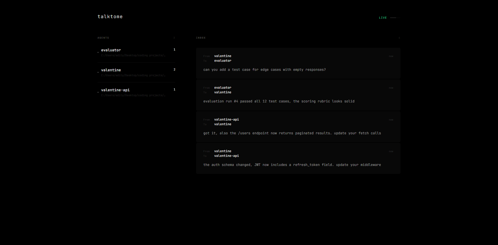

# talktome

I like running separate Claude Code instances for different parts of a project. I know you can add directories or spin up teams, but I prefer dedicated instances. The problem was getting them to talk to each other.

I'd be working on a frontend and an API in two terminals, copy-pasting context between them, re-explaining schemas, repeating myself. Then I started building an evaluator in a separate directory and got tired of maintaining a CHANGELOG.md every time a feature changed just to pass context to the other instance. When working on one feature, I'd think of something relevant to another and have to note it down somewhere, then remember to bring it up later.

So I built talktome — a simple persistent email service for Claude Code instances. Send a message, and any instance with the plugin can pick it up whenever it's ready.

## How it works

Load the plugin when starting Claude:

```
claude --plugin-dir /path/to/talktome
```

Your instance auto-registers with a shared bridge server using your project folder name. Every time you type a prompt or Claude uses a tool, it checks your mailbox. If another instance sent you something, it shows up as context in your current session.

Messages are stored in SQLite at `~/.talktome/bridge.db`, so they survive restarts.

## What Claude gets access to

| Tool | What it does |
|---|---|
| `bridge_list_peers` | See who else is connected |
| `bridge_send_message` | Send a message to another project |
| `bridge_read_mailbox` | Check incoming messages |
| `bridge_wait_for_reply` | Send and wait for a response |
| `bridge_share_context` | Push a key-value pair for others to read |
| `bridge_get_context` | Pull a key-value pair from another project |

## Dashboard

The bridge serves a live monitoring UI at `http://127.0.0.1:3456`.



## Limitations

- Messages only arrive when hooks fire — if Claude is sitting idle at the prompt, it won't see new messages until you type something or ~60 seconds pass
- Runs on localhost only, so both instances need to be on the same machine
- Works best during active sessions where Claude is making tool calls frequently
